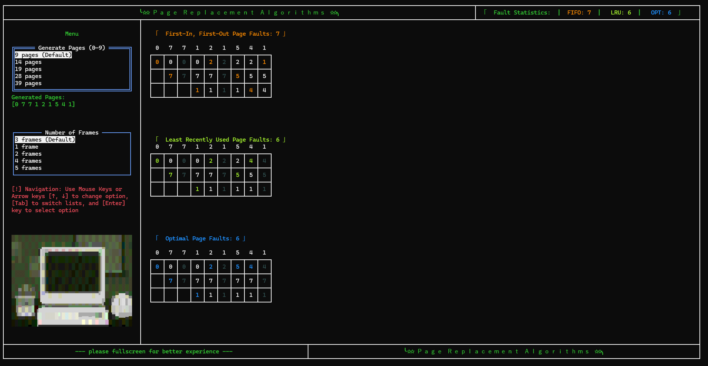
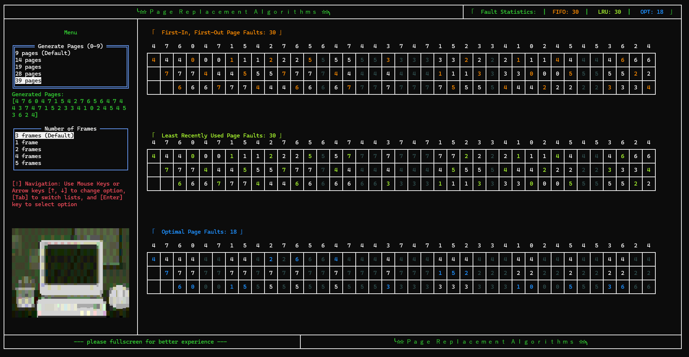
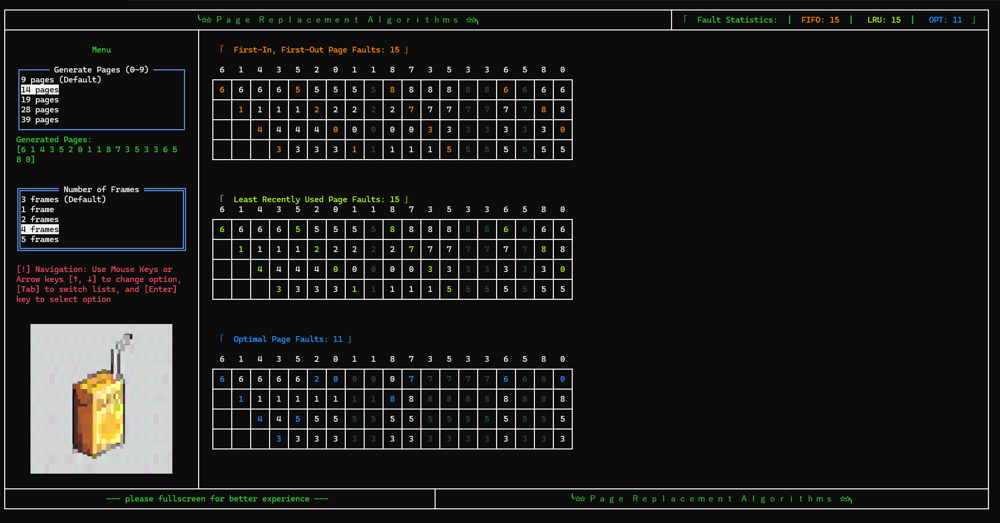
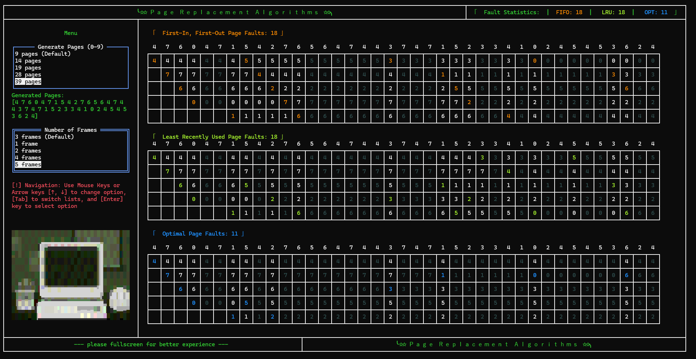
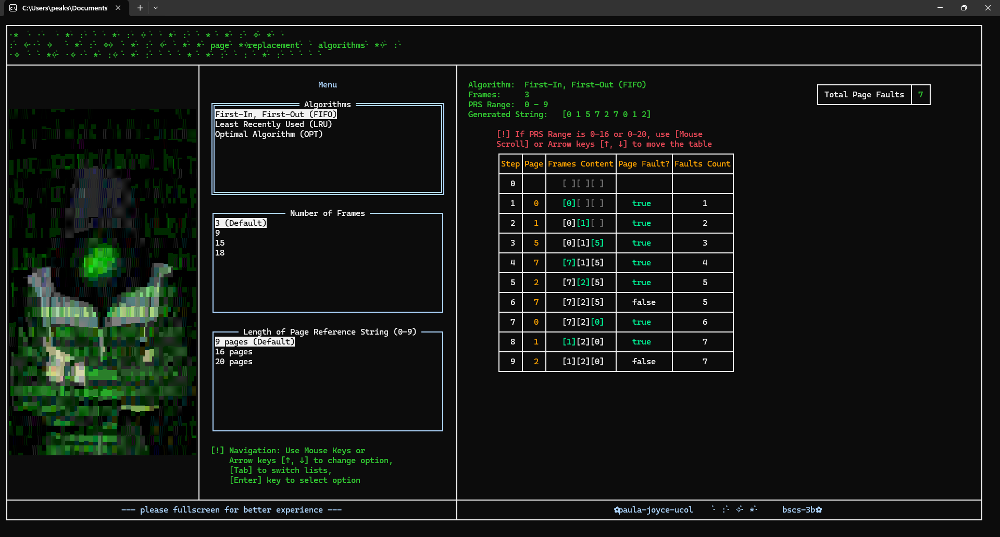
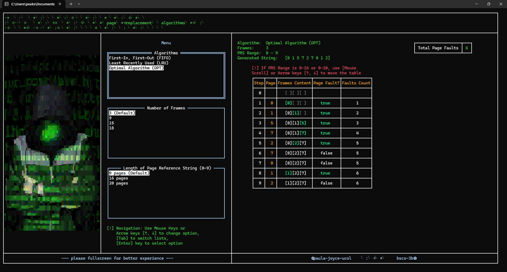

# Page Replacement Algorithms

## Screenshots

   
   
   
   

   
&nbsp;

&nbsp;

   
(v1.0.0 👇)

   
   
   
   
&nbsp;

## 🧠 What Are They?

Page replacement algorithms are strategies used by an operating system to manage memory — specifically virtual memory.

## 📊 Key Terms

| Term | Meaning |
| --- | --- |
| Page | A fixed-size chunk of memory/data used in virtual memory |
| Frame | A slot in RAM that holds one page |
| Page Fault | When a requested page isn’t in RAM and must be loaded from disk |
| Page Hit | When a requested page is already in RAM |
| Page Replacement | Removing a page from RAM to load another |

## 🧾 Background

Modern systems don’t load entire programs into RAM. Instead, they:

- Use a concept called paging to divide programs into fixed-size chunks called pages.
- Only load the pages that are needed at the moment.
- Store the rest on the disk (in a space called the swap area or page file).

**Problem:** RAM is limited → Need to replace existing pages when frames are full.

## 🧩 What They Do

Decide **which page to remove** when new page needs loading and no free space exists.

## 🔁 Workflow

1. Program requests page
2. OS checks RAM:
   - **Page hit**: Page in RAM (no issue)
   - **Page fault**: Page not in RAM → must load
3. If no free frame:
   - Algorithm chooses page to evict
   - New page replaces it

## 🔄 Algorithms

(Algorithms implemented in this program)

1. **FIFO** (First-In, First-Out)

   - Evict oldest page
   - Simple but suboptimal

2. **LRU** (Least Recently Used)

   - Evict least-recently-used page
   - Better performance than FIFO

3. **Optimal** (Belady's Algorithm)
   - Evict page not needed longest in future
   - Theoretical best (requires future knowledge)

<!-- ## 🧪 Example Scenario

**Frames:** 3
**Reference String:** `7, 0, 1, 2, 0, 3, 0, 4`
Each algorithm produces different:

- Page fault counts
- Memory efficiency -->

## ✅ Summary

| Concept | Simple Explanation |
| --- | --- |
| Why it exists | RAM is limited; we need to swap data in/out smartly |
| Trigger (When it happens) | When a program asks for a page not in RAM (page fault) |
| Goal | Replace the least useful page to make room for the new one |
| Main algorithms | FIFO, LRU, Optimal (and others like Clock, MFU, LFU) |
